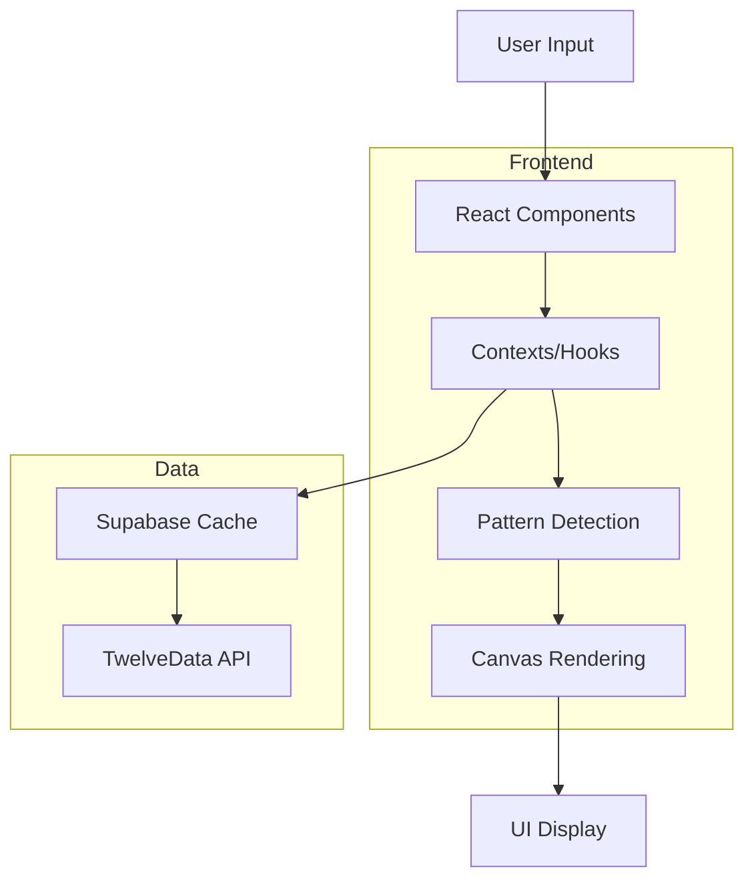

# Architecture Diagram

```mermaid
graph TD
    A[User Input] --> B[React Components]
    B --> C[Contexts/Hooks]
    C --> D[Pattern Detection]
    D --> E[Canvas Rendering]
    E --> F[UI Display]
    C --> G[Supabase Cache]
    G --> H[TwelveData API]
    subgraph Frontend
        B
        C
        D
        E
    end
    subgraph Data
        G
        H
    end
``` 