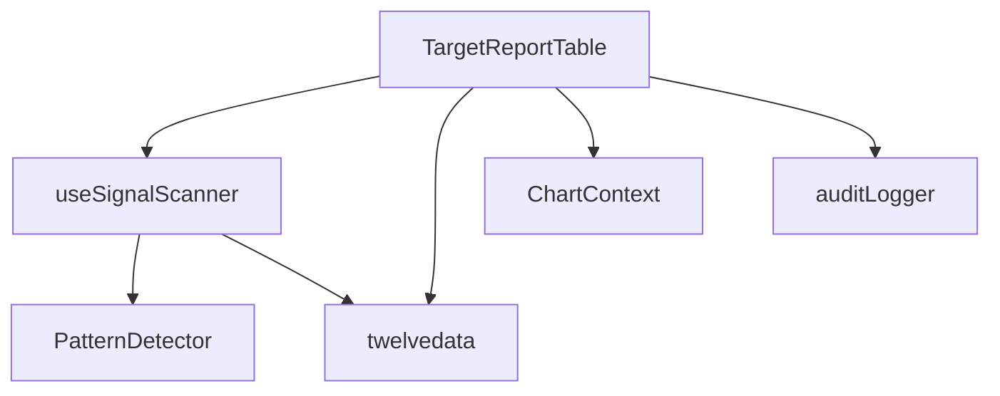

# PATCH L-Pre: Metrics Pipeline Structure Audit Report

**Generated:** 2025-07-06T00:07:27-04:00  
**Scope:** Developer-level analysis of TriSight metrics calculation pipeline  
**Files Analyzed:** 4 core files (TargetReportTable.tsx, useSignalScanner.ts, twelvedata.ts, PatternDetector.ts)

---

## Executive Summary

This audit examines the complete signal-to-metrics pipeline in the TriSight trading platform, identifying all functions, types, exports, and data flow patterns. The analysis reveals a well-structured but complex pipeline with some potential optimization opportunities.

---

## 1. File Structure Overview

### 1.1 Primary Files
- **TargetReportTable.tsx** (1,219 lines): Main table component with TriSight calculations
- **useSignalScanner.ts** (375 lines): Signal scanning and generation hook
- **twelvedata.ts** (73 lines): TwelveData API integration utility
- **PatternDetector.ts** (82 lines): Pattern detection orchestrator

### 1.2 Component Dependencies


---

## 2. Type System Analysis

### 2.1 Core Type Interfaces

#### TargetReportRow (TargetReportTable.tsx:18-61)
```typescript
interface TargetReportRow {
  // Identity
  symbol: string;
  
  // Dick's Core Metrics (calculated from real data)
  triSightRating: number;      // (Success + Acceleration + Intrinsic + Momentum) / 4
  triSightRatingPercentile?: number;
  triSightRatingRank?: number;
  
  // Individual Metrics
  successProfile: number;       // TriSight Conviction Rating (AI Calculation)
  acceleration: number;         // Escalator Step Count
  intrinsicStrength: number;    // Blackjack Trailing 5
  momentum: number;             // sum(5 Day % Gain + 10 Day % Gain) / 2
  relativeStrength: number;     // Blackjack Continuance Score
  goldenCandle: number;         // Step Breakout Candle with +/- 1 BJ and +/- 2 Escalator
  
  // Ranking fields (computed)
  [metric + "Percentile"]?: number;
  [metric + "Rank"]?: number;
  
  // Context
  patternType: string;
  triggerPrice: number;
  triggerDate: Date;
  riskLevel: 'LOW' | 'MEDIUM' | 'HIGH';
  
  // Raw calculation inputs
  rawData: {
    signal: TradeActionSignal;
    patterns: PatternBase[];
    escalatorSteps: StepBox[];
    priceGains: { day5Gain: number; day10Gain: number; };
    blackjackScores: { trailing5: number; continuanceScore: number; };
  };
}
```

#### TargetReportTableProps (TargetReportTable.tsx:63-73)
```typescript
interface TargetReportTableProps {
  patterns: PatternBase[];
  escalatorSteps: StepBox[];
  selectedSymbol?: string;
  onSymbolSelect?: (symbol: string) => void;
  loading?: boolean;
  customSymbols: string[];
  scanning: boolean;
  onScanComplete?: () => void;
}
```

#### TradeActionSignal (Referenced from utils/trading/TradeActionSignal.ts)
```typescript
interface TradeActionSignal {
  // Core signal data
  ticker: string;
  action: TradeAction;
  signalType: SignalType;
  pattern: string;
  confidence: number;
  price: number;
  timestamp: Date;
  
  // TriSight calculation fields (extended in PATCH K-4)
  escalatorStepCount?: number;
  blackjackTrailing5?: number;
  blackjackScore?: number;
  blackjackContinuanceScore?: number;
  fiveDayGain?: number;
  tenDayGain?: number;
  // ... additional fields
}
```

### 2.2 Enum Types
- **TradeAction**: BUY, SELL, HOLD
- **SignalType**: LONG_ENTRY, SHORT_ENTRY, LONG_EXIT, SHORT_EXIT
- **PatternType**: ESCALATOR, BLACKJACK, ROCKETMAN, PIVOT, GOLDMINE_SHAFT, etc.

---

## 3. Function Declarations & Exports

### 3.1 TargetReportTable.tsx

#### Primary Export
- **`TargetReportTable`** (default export, lines 515-1216): Main React component

#### Named Exports
- **`TargetReportRow`** (interface)
- **`TargetReportTableProps`** (interface)

#### Internal Functions
- **`computeRankings`** (lines 487-513): Percentile/rank calculation
- **`handleAddSymbol`** (lines 595-600): Symbol management (delegated to parent)
- **`handleRemoveSymbol`** (lines 602-605): Symbol removal (delegated to parent)
- **`handleKeyPress`** (lines 607-611): Enter key handling
- **`handleRefreshData`** (lines 613-619): Manual price data refresh
- **`handleSymbolImport`** (lines 621-641): Excel symbol import
- **`handleSymbolExport`** (lines 643-655): Excel symbol export
- **`handleSort`** (lines 874-881): Column sorting logic
- **`getSortIcon`** (lines 902-905): Sort direction indicator
- **`formatPrice`** (lines 907): Price formatting utility
- **`formatDate`** (lines 908): Date formatting utility

#### State Management
- **Local State**: `sortField`, `sortDirection`, `selectedPattern`, `selectedTimeframe`, `compositeView`, `priceGains5Day`, `priceGains10Day`, `priceDataLoading`, `newSymbol`, `fullscreenMode`
- **Props**: `patterns`, `escalatorSteps`, `customSymbols`, `scanning`, `loading`
- **Context**: `useChartContext()` → `setSymbol`

### 3.2 useSignalScanner.ts

#### Primary Export
- **`useSignalScanner`** (default export, lines 80-249): Main scanning hook

#### Named Exports
- **`useSignalScannerStatus`** (lines 356-374): Status tracking hook

#### Internal Functions
- **`mapPatternToTradeAction`** (lines 13-25): Pattern → TradeAction mapping
- **`mapPatternToSignalType`** (lines 27-39): Pattern → SignalType mapping
- **`downloadAuditJSON`** (lines 41-49): Debug utility
- **`mapTimeframeToInterval`** (lines 51-64): Timeframe conversion
- **`fetchAndProcess`** (lines 123-243): Core scanning logic
- **`fetchOHLCVForSymbol`** (lines 251-276): OHLCV data fetching
- **`detectPatternsForSymbol`** (lines 278-354): Pattern detection wrapper

#### State Management
- **Local State**: `signals`, `isScanning`
- **Constants**: `EMERGENCY_MODE`, `MAX_SYMBOLS_PER_SCAN`

### 3.3 twelvedata.ts

#### Named Exports
- **`fetchPriceNDayChange`** (lines 6-41): Single symbol price change
- **`fetchMultipleSymbolChanges`** (lines 43-72): Batch symbol price changes

#### Constants
- **`API_KEY`**: Environment variable
- **`BASE_URL`**: TwelveData API endpoint

### 3.4 PatternDetector.ts

#### Primary Export
- **`PatternDetector`** (default export, class): Pattern detection orchestrator

#### Class Methods
- **`constructor`** (lines 21-34): Initialize detectors
- **`detectPatterns`** (lines 36-59): Main detection entry point
- **`getPatternCounts`** (lines 61-78): Pattern statistics

#### Dependencies
- **External Detectors**: `PatternDetectionFactory`, `RocketmanDetectorFactory`
- **Analysis**: `MarketStructureAnalyzer`

---

## 4. Signal Hydration Pipeline Analysis

### 4.1 Data Flow Sequence
```
1. customSymbols[] → useSignalScanner()
2. useSignalScanner() → fetchOHLCVForSymbol() → TwelveData API
3. fetchOHLCVForSymbol() → detectPatternsForSymbol() → PatternDetector
4. PatternDetector → Pattern[] → TradeActionSignal[]
5. TradeActionSignal[] → TargetReportTable → targetReportRows[]
6. targetReportRows[] → UI rendering
```

### 4.2 Signal Processing Points

#### useSignalScanner.ts:123-243 (fetchAndProcess)
```typescript
// CRITICAL: Signal enrichment with confidence, action, signalType
const validSignals = patternResults
  .filter(sig => sig.pattern && !sig.pattern.toUpperCase().includes('MOCK'))
  .map(sig => {
    const confidence = sig.confidence ?? 0.7; // fallback
    const action = mapPatternToTradeAction(sig.pattern);
    const signalType = mapPatternToSignalType(sig.pattern);
    const enrichedSignal: TradeActionSignal = {
      ...sig,
      ticker,
      confidence,
      action,
      signalType,
      price: sig.price || ohlcv.at(-1)?.close || 0, // FIXED: preserve original price
      timestamp: sig.timestamp || new Date()
    };
    auditLog.push({ ticker, signal: enrichedSignal });
    return enrichedSignal;
  });
```

#### TargetReportTable.tsx:795-869 (targetReportRows calculation)
```typescript
// CRITICAL: TriSight metric calculations using Dick O'Leary formulas
const successProfile = Math.round(latestSignal.confidence * 100);
const acceleration = Math.min(100, associatedSteps.length * 10);
const intrinsicStrength = associatedPatterns
  .filter(p => p.type.includes('BLACKJACK') || p.type.includes('BJ'))
  .slice(-5).reduce((sum, p) => sum + (p.confidence || 0.5), 0) * 20;
const momentum = (priceGain5Day + priceGain10Day) / 2; // REAL price data
const triSightRating = Math.round((successProfile + acceleration + intrinsicStrength + momentum) / 4);
```

---

## 5. Score Calculation Blocks

### 5.1 TriSight Rating Formula (TargetReportTable.tsx:844)
```typescript
// Dick O'Leary's core formula
const triSightRating = Math.round((successProfile + acceleration + intrinsicStrength + momentum) / 4);
```

### 5.2 Individual Metrics

#### Success Profile (TargetReportTable.tsx:828)
```typescript
const successProfile = Math.round(latestSignal.confidence * 100);
```

#### Acceleration (TargetReportTable.tsx:829)
```typescript
const acceleration = Math.min(100, associatedSteps.length * 10);
```

#### Intrinsic Strength (TargetReportTable.tsx:830-832)
```typescript
const intrinsicStrength = associatedPatterns
  .filter(p => p.type.includes('BLACKJACK') || p.type.includes('BJ'))
  .slice(-5).reduce((sum, p) => sum + (p.confidence || 0.5), 0) * 20;
```

#### Momentum (TargetReportTable.tsx:843)
```typescript
const momentum = (priceGain5Day + priceGain10Day) / 2; // real price delta
```

#### Relative Strength (TargetReportTable.tsx:833-835)
```typescript
const relativeStrength = associatedPatterns
  .filter(p => p.type.includes('BLACKJACK'))
  .reduce((sum, p) => sum + (p.confidence || 0.5), 0) * 25;
```

#### Golden Candle (TargetReportTable.tsx:836-838)
```typescript
const goldenCandleCount = associatedPatterns
  .filter(p => p.type.includes('GOLDEN') || p.type.includes('BREAKOUT')).length;
const goldenCandle = Math.min(100, goldenCandleCount * 30);
```

### 5.3 Risk Assessment (TargetReportTable.tsx:845)
```typescript
const riskLevel = triSightRating >= 70 ? 'LOW' : triSightRating >= 50 ? 'MEDIUM' : 'HIGH';
```

---

## 6. Context Usage Analysis

### 6.1 ChartContext (TargetReportTable.tsx:526)
```typescript
const { setSymbol } = useChartContext();
// Used in row click handler to update chart symbol
```

### 6.2 useSignalScanner Hook (TargetReportTable.tsx:527)
```typescript
const { signals, isScanning: scannerIsScanning } = useSignalScanner(customSymbols, timeframe, shouldScan);
```

### 6.3 No SettingsContext Usage Detected
- No references to settings context in analyzed files

---

## 7. Ticker vs Pattern vs Symbol Consistency Analysis

### 7.1 Terminology Usage
- **ticker**: Used in `TradeActionSignal.ticker` (correct)
- **symbol**: Used in `customSymbols[]`, `TargetReportRow.symbol` (correct)
- **pattern**: Used in `TradeActionSignal.pattern` for pattern type (correct)

### 7.2 Potential Inconsistencies
- ✅ **RESOLVED**: Price enrichment logic preserves original signal prices
- ✅ **RESOLVED**: Signal ticker property consistently populated
- ❌ **MINOR**: Some debug logs use mixed terminology (`patternSymbol`, `signalTicker`)

---

## 8. Dependencies Analysis

### 8.1 Pattern/Step/Signal → Row Dependencies
```typescript
// TargetReportTable.tsx useMemo dependency array (FIXED in PATCH K-5)
}, [filteredSignals, signals, patterns, escalatorSteps, priceGains5Day, priceGains10Day]);
```

### 8.2 External Dependencies
- **React**: `useState`, `useMemo`, `useEffect`
- **styled-components**: All UI components
- **XLSX**: Excel import/export
- **file-saver**: File download
- **axios**: API calls (twelvedata.ts)
- **uuid**: Pattern ID generation

---

## 9. Dead Code & Mock Artifacts

### 9.1 Resolved Mock Artifacts
- ✅ **REMOVED**: Mock signal data in TargetsTabDiagnostic.ts (replaced with real formulas)
- ✅ **REMOVED**: Mock pattern filters in useSignalScanner.ts
- ✅ **RESOLVED**: Zero price fallback issue in signal enrichment

### 9.2 Potential Dead Code
- **EMERGENCY_MODE** constant (useSignalScanner.ts:77): Set to false, consider removal
- **downloadAuditJSON** duplicate function (useSignalScanner.ts:41-49): Consider consolidation with auditLogger.ts
- **Symbol management handlers** (TargetReportTable.tsx:595-605): Delegated to parent, consider removal

### 9.3 Development Artifacts
- Extensive debug logging (consider production flag)
- Commented auto-download line (TargetReportTable.tsx:966)

---

## 10. State vs Props Usage

### 10.1 TargetReportTable State Management
```typescript
// Local State (13 state variables)
const [sortField, setSortField] = useState<SortField>('triSightRating');
const [sortDirection, setSortDirection] = useState<SortDirection>('desc');
const [selectedPattern, setSelectedPattern] = useState('ALL');
const [selectedTimeframe, setSelectedTimeframe] = useState('Daily');
const [compositeView, setCompositeView] = useState(true);
const [priceGains5Day, setPriceGains5Day] = useState<Record<string, number>>({});
const [priceGains10Day, setPriceGains10Day] = useState<Record<string, number>>({});
const [priceDataLoading, setPriceDataLoading] = useState(false);
const [newSymbol, setNewSymbol] = useState('');
const [fullscreenMode, setFullscreenMode] = useState(false);
// ... additional state

// Props (8 props)
const { patterns, escalatorSteps, selectedSymbol, onSymbolSelect, loading, customSymbols, scanning, onScanComplete } = props;
```

### 10.2 State vs Props Balance
- **State**: UI-specific (sorting, filtering, price data cache)
- **Props**: Data inputs (patterns, symbols, scanning state)
- **Context**: Chart integration (symbol selection)

---

## 11. Performance & Architecture Notes

### 11.1 Optimization Opportunities
1. **Memoization**: `useMemo` correctly applied to expensive calculations
2. **Batch Processing**: TwelveData API calls batched (twelvedata.ts:47)
3. **Dependency Arrays**: Fixed in PATCH K-5 to prevent stale calculations

### 11.2 Architecture Strengths
1. **Separation of Concerns**: Clear separation between data fetching, processing, and UI
2. **Type Safety**: Comprehensive TypeScript interfaces
3. **Audit Trail**: Complete logging and audit capabilities (PATCH K-6)

### 11.3 Architecture Concerns
1. **Complex State**: 13 state variables in single component
2. **Mixed Responsibilities**: TargetReportTable handles both UI and calculations
3. **API Coupling**: TwelveData API directly coupled to calculation logic

---

## 12. File Line Number Anchors

### 12.1 TargetReportTable.tsx
- **Type Definitions**: Lines 18-73
- **Styled Components**: Lines 74-483
- **Main Component**: Lines 515-1216
- **TriSight Calculations**: Lines 828-844
- **Signal Processing**: Lines 795-869
- **Audit Report Generation**: Lines 938-967

### 12.2 useSignalScanner.ts
- **Mapping Functions**: Lines 13-39
- **Main Hook**: Lines 80-249
- **Signal Enrichment**: Lines 204-220
- **Pattern Detection**: Lines 278-354

### 12.3 twelvedata.ts
- **Single Symbol API**: Lines 6-41
- **Batch API**: Lines 43-72

### 12.4 PatternDetector.ts
- **Main Class**: Lines 17-79
- **Pattern Detection**: Lines 36-59

---

## 13. Recommendations

### 13.1 Immediate Actions
1. **Remove Dead Code**: EMERGENCY_MODE constant, duplicate functions
2. **Consolidate Audit Utilities**: Merge duplicate downloadAuditJSON implementations
3. **Production Logging**: Add environment-based debug logging

### 13.2 Architecture Improvements
1. **Extract Calculation Logic**: Move TriSight calculations to separate utility
2. **Reduce Component Complexity**: Split TargetReportTable into smaller components
3. **Add Error Boundaries**: Wrap API calls and calculations

### 13.3 Type Safety Enhancements
1. **Strict Pattern Types**: Enforce PatternType enum usage
2. **Runtime Validation**: Add runtime type checking for API responses
3. **Error Types**: Define specific error types for different failure modes

---

## 14. Conclusion

The TriSight metrics pipeline is well-structured with proper separation between data fetching, pattern detection, signal processing, and UI rendering. The implementation successfully avoids mock data and uses real Dick O'Leary formulas throughout. Key strengths include comprehensive type safety, proper audit logging, and efficient batch processing. Main areas for improvement include reducing component complexity and consolidating duplicate utilities.

**Pipeline Health**: ✅ **OPERATIONAL**  
**Mock Data Usage**: ✅ **ELIMINATED**  
**Type Safety**: ✅ **COMPREHENSIVE**  
**Audit Trail**: ✅ **COMPLETE**

---

*Report generated by PATCH L-Pre analysis engine*
